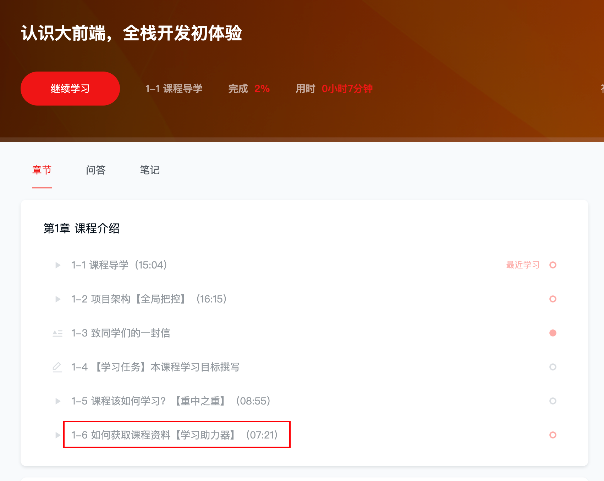
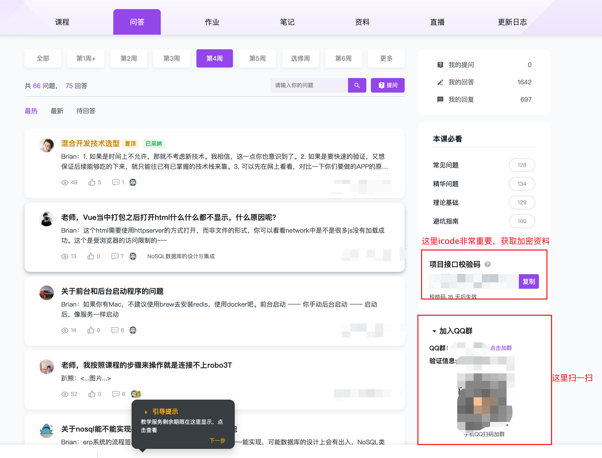
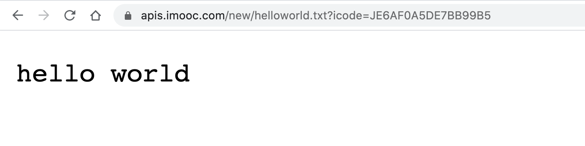

# 课程资料说明

项目代码及文档说明仓库，这个仓库是关于代码 + 资料的说明


## 资料说明视频节

一定要看看我们的第一周的资料获取的章节：




## 加入QQ群

加入我们的课程Q群：课程 ---> 问答 ---> 右侧 “加入QQ群” 点击展开，可以扫一扫入群



## icode使用说明

格式：（**周数为数字**）

```
https://apis.imooc.com/new/周数.zip?icode=xxxx
```

说明：

- 对应周有对应的zip加密资料
- 检查自己的格式，检查 icode 是否过期


举例：



